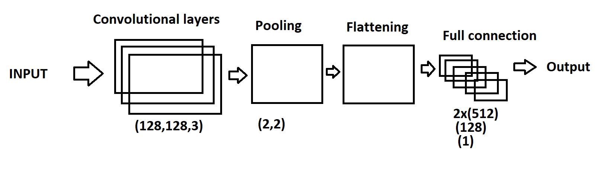
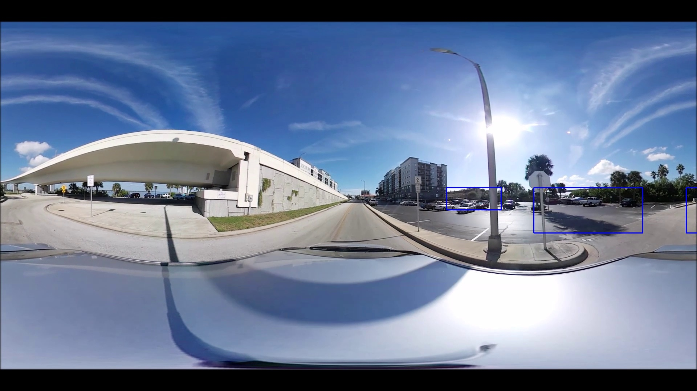
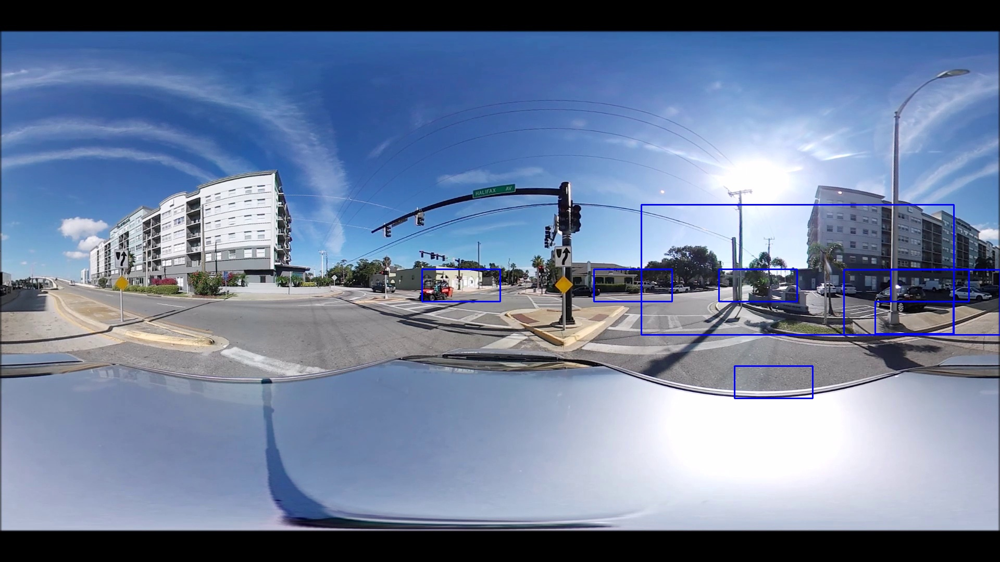
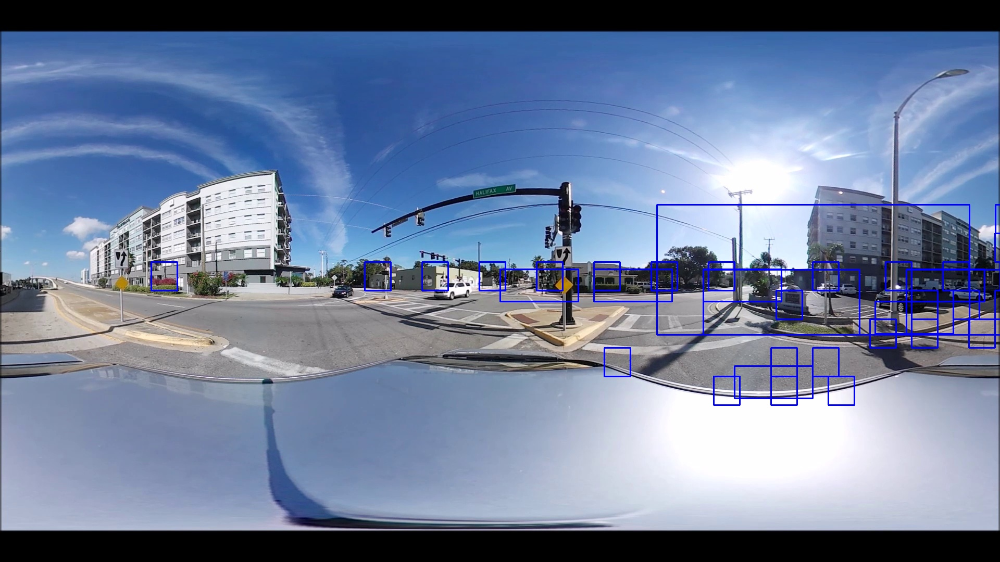

# Video-processing-system-for-object-recognition-using-convolutional-neural-networks-CNN-
The following repository is about the procedure performed in the development of video processing for object recognition by means of convolutional neural networks (CNN). For the aforementioned, a Python code was used using libraries such as TensorFlow, Open CV, Numpy, and Keras, allowing to process each of the video frames.

## Introduction
Most of the learning methods used
in Deep Learning, understand network architectures
neural. These models are trained from the use of
certain data sets tagged with structures
(Neural Networks) that learn from said data,
without the need to manually extract these
sets.
One of the best known neural network architectures,
corresponds to the conventional neural network CNN, which is
responsible for implementing 2D convolutional layers from
of the features learned with the input data.
Its operating principle is based on the extraction of
characteristics of a set of images, where those
are not trained in advance, but are
learn while the network trains from a collection
of images (Dataset). That is why, in this way, this
structure greatly helps implementations such as
they are object detection. Considering that you are
can implement hundreds of hidden neural layers, each
one of them assigned to a specific task, concluding with
quite a precise structure.
From this, a convolutional neural network is implemented,
to take care of vehicle detection. Is
will be trained from vehicle clippings obtained from
the frames resulting from the decomposition of a video into
360° in vehicular traffic.

### CNN

### Results

